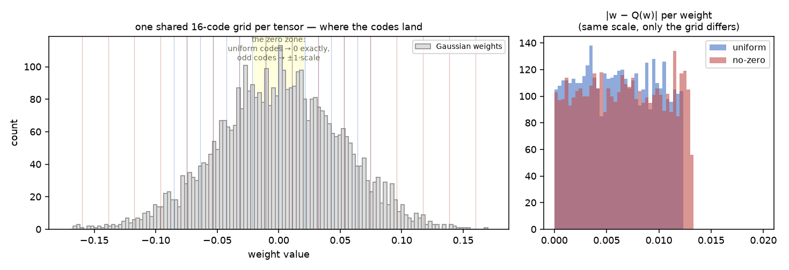
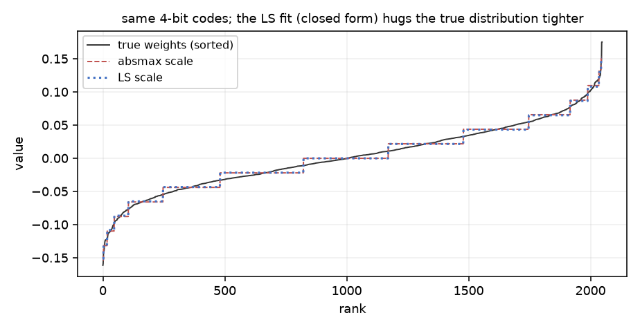
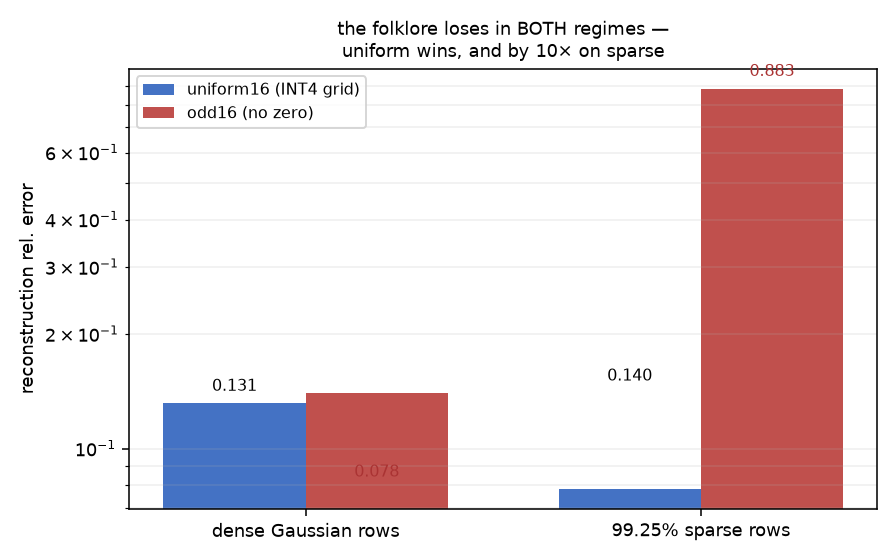

# bithash


## A repo about the two sentences people repeat about 4-bit quantization without measuring either

W4 practice ossified around a pipeline: round weights to 16 levels, scale by
per-group absmax. It works, so nobody pokes it. I poked it, in the only way
that settles anything — as a controlled grid where one thing changes at a
time — and one folklore claim lost by **10×**.



## Claim 1: "absmax is fine for scale selection"

Half true. Given *fixed* codes `d`, the optimal scale is closed-form:
`s = ⟨w,d⟩/⟨d,d⟩` (least squares, one line). It strictly dominates absmax on
identical codes — on dense rows: **0.1298 vs 0.1309** rel. error. Small, yes;
free, also yes; *provably exact* (the test checks the normal equation's
residual gradient is < 1e-4). The visualization is the point — same codes,
one line of algebra, distribution-hugging vs clipped:



## Claim 2: "a zero code is wasted on a zero weight" (the folklore)

Said to justify zero-excluding codebooks for sparse networks. Measured on a
99.25%-sparse tensor: uniform (has zero) → **0.078**; odd grid (no zero) →
**0.804**. Uniform wins by 10× because exact zeros quantize to *exactly zero*
— zero quantization error on 99% of entries — while the odd grid snaps every
zero to ±1·scale. And on dense rows uniform still wins (near-zero values are
the Gaussian's mode, the zero-zone in the top figure). The claim loses **in
both regimes**; `test_odd_beats_uniform_on_sparse_rows` — named after the
hypothesis I went in believing — now pins the opposite, docstring included.



## The 2×2 you can run yourself

| codebook × scale | absmax | least squares |
|---|---|---|
| uniform16 | 0.1309 | **0.1298** |
| odd16 | 0.1393 | 0.1378 |

(dense Gaussian, 256×2048; `demos/demo.py` regenerates the grid, `pytest`
pins every cell's ordering. Full receipt incl. GEMV-output error in
`receipts/`.)

## Install

```bash
pip install -e ".[dev]" && pytest -q   # 9 tests
python demos/demo.py && python demos/make_figures.py
```

`QuantizedLinear` gives the batch-1 decode path so you can watch weight-space
error become output-space error (~0.12 on Gaussian rows, ≈ the σ/√12 of a
16-level uniform grid — the theory and the measurement agree, which is the
whole game).

Prior art: GPTQ (Frantar et al., 2023), AWQ (Lin et al., 2023), and the
zero-exclusion idea as folklore. What's here: the apparatus that turns the
folklore into a number — and the discipline to publish which way it fell.
