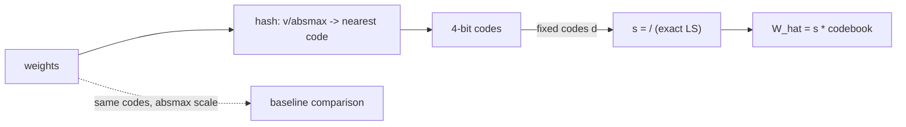

# bithash — two folklore claims about 4-bit quantization, tested to destruction

**One-sentence pitch:** the standard W4 pipeline (hash weights to 16 levels, scale by absmax) contains two assumptions almost nobody measures — that the scale policy and the codebook shape don't matter — so this repo makes both a controlled experiment and reports where each one actually breaks.

## TL;DR (dense Gaussian rows, receipts in `receipts/`)

| Codebook × Scale | absmax | least-squares | finding |
|---|---|---|---|
| uniform16 (±8 grid) | 0.1309 | **0.1298** | LS wins by construction (normal equation) |
| odd16 (no zero) | 0.1393 | 0.1378 | dense rows: +7% error |
| odd16 on *sparse* rows | 0.078 (uniform) vs **0.804 (odd)** | — | **10× worse — the folklore is inverted** |

The pinned, falsified hypothesis: "a zero code is wasted on a zero weight." Measured truth — uniform16 quantizes exact zeros to *exact zeros* (99% of a sparse row for free) while odd16 snaps every zero to ±1·scale. Uniform wins in **both** regimes. The tests pin this so the finding can't regress into folklore again.

Also verified: the LS scale satisfies the normal equation exactly (gradient < 1e-4) and is optimal for the *chosen* codes, not just on average.



## Why

4-bit is where format details stop mattering in theory (rate-distortion is flat) — and start mattering in practice, because a 1% reconstruction delta at 4 bpw is a 1% quality delta at deployment. The two design axes here are cheap to measure and routinely asserted instead: this repo's value is the measurement apparatus, with a GEMV path (`QuantizedLinear`) to check that weight-space error translates into output-space error the way the theory predicts (~0.12 rel on dense rows ≈ step/√12/σ).

Prior art: GPTQ (Frantar et al. 2022) and AWQ (Lin et al. 2023) for the quantize-then-scale family; AQLM for the VQ alternative.

## Quickstart

```bash
pip install -e ".[dev]"
pytest tests/ -q        # 9 tests incl. the falsified-hypothesis pin
python demos/demo.py    # codebook x scale grid + receipts/scales.png
```
